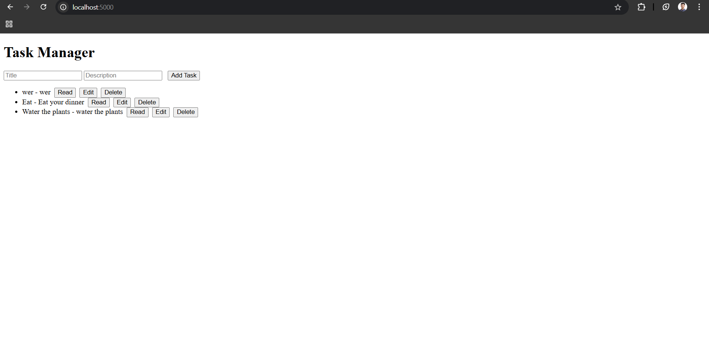
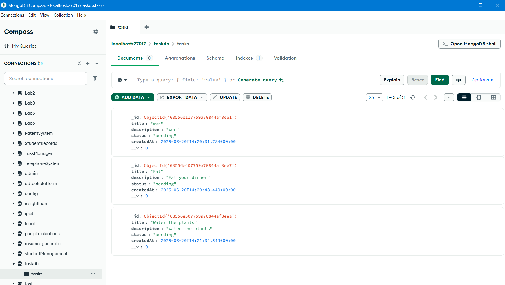
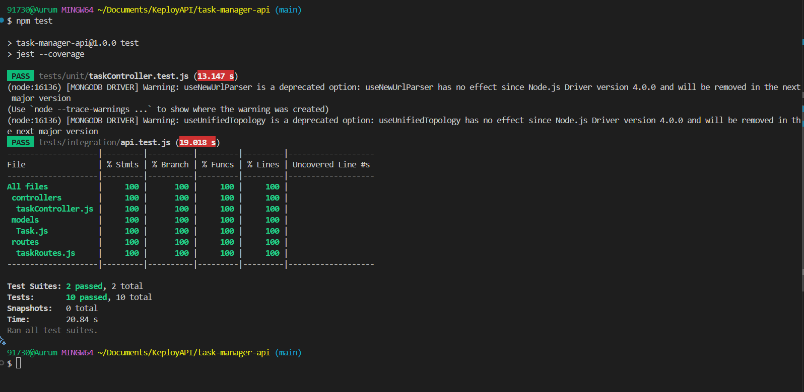

# Task Manager API

A simple Node.js + MongoDB API for managing tasks, with an optional frontend.

##  API Endpoints

| Method | Endpoint           | Description            |
|--------|--------------------|------------------------|
| GET    | `/api/tasks`       | Get all tasks          |
| GET    | `/api/tasks/:id`   | Get a single task      |
| POST   | `/api/tasks`       | Create a new task      |
| PUT    | `/api/tasks/:id`   | Update a task          |
| DELETE | `/api/tasks/:id`   | Delete a task          |

##  Database

- **MongoDB** is used for storing tasks.
- Integrated using [Mongoose](https://mongoosejs.com/).

##  How to Run the Server

1. Install dependencies:
   ```sh
   npm install
   ```
2. Set up your `.env` file (already present):
   ```
   PORT=5000
   MONGO_URI=mongodb://localhost:27017/taskdb
   ```
3. Start the server:
   ```sh
   npm run dev
   ```

##  How to Run the Frontend 

- The frontend is served automatically at [http://localhost:5000/](http://localhost:5000/) when the server is running.

##  Sample API Requests

```sh
# Create a new task
curl -X POST http://localhost:5000/api/tasks \
-H "Content-Type: application/json" \
-d '{"title": "Sample Task", "description": "A demo task"}'

# Get all tasks
curl http://localhost:5000/api/tasks

# Get a single task (replace <id> with a real task ID)
curl http://localhost:5000/api/tasks/<id>

# Update a task (replace <id> with a real task ID)
curl -X PUT http://localhost:5000/api/tasks/<id> \
-H "Content-Type: application/json" \
-d '{"title": "Updated Title", "description": "Updated description"}'

# Delete a task (replace <id> with a real task ID)
curl -X DELETE http://localhost:5000/api/tasks/<id>
```





##  Testing

### Tech Stack
- **Node.js**, **Express**, **MongoDB**, **Mongoose**
- **Jest** & **Supertest** for testing

### How to Run Tests

1. Install dependencies:
   ```sh
   npm install
   ```
2. (Optional) Ensure MongoDB is running and a test database is available (e.g., `taskdb_test`).
3. Run all tests and see coverage:
   ```sh
   npm test
   ```

### Testing Tools Used
- **Jest**: For unit and integration testing, and coverage reporting.
- **Supertest**: For API endpoint testing.

### Coverage
- **100%** code coverage for statements, branches, functions, and lines.
- Coverage reports are generated in the `/coverage` folder. Open `coverage/lcov-report/index.html` in your browser for a detailed report.

### Test Types
- **Unit tests**: Located in `tests/unit/`, use mocking for database logic.
- **Integration/API tests**: Located in `tests/integration/`, use a real MongoDB test database to verify CRUD operations.

---

**You are ready to submit your repository link!**  
Your project meets all requirements for code coverage, test types, and documentation.##  Testing

### Tech Stack
- **Node.js**, **Express**, **MongoDB**, **Mongoose**
- **Jest** & **Supertest** for testing

### How to Run Tests

1. Install dependencies:
   ```sh
   npm install
   ```
2. (Optional) Ensure MongoDB is running and a test database is available (e.g., `taskdb_test`).
3. Run all tests and see coverage:
   ```sh
   npm test
   ```

### Testing Tools Used
- **Jest**: For unit and integration testing, and coverage reporting.
- **Supertest**: For API endpoint testing.

### Coverage
- **100%** code coverage for statements, branches, functions, and lines.
- Coverage reports are generated in the `/coverage` folder. Open `coverage/lcov-report/index.html` in your browser for a detailed report.

### Test Types
- **Unit tests**: Located in `tests/unit/`, use mocking for database logic.
- **Integration/API tests**: Located in `tests/integration/`, use a real MongoDB test database to verify CRUD operations.

---

